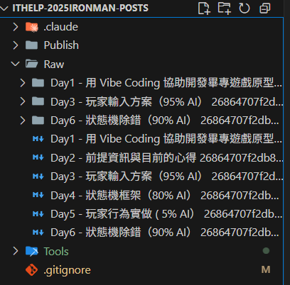
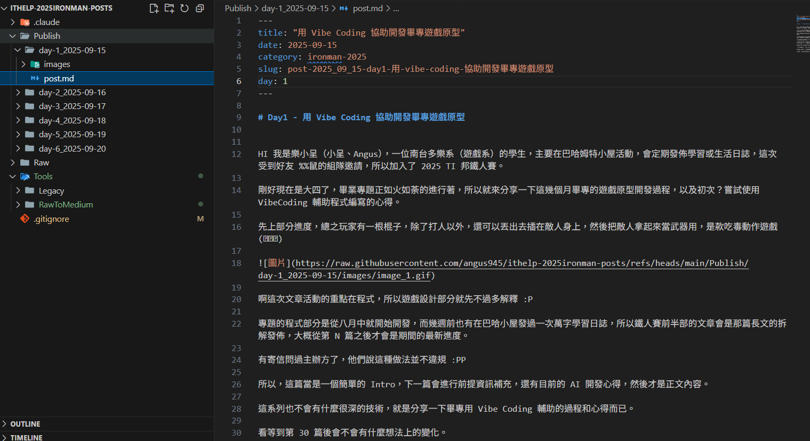

# RawToMedium - Raw 到 Medium 格式轉換工具

將 Raw 資料夾中的 Notion Markdown 檔案直接轉換成適合 Medium 發布的格式，還有拿 github 當做圖床。

## 使用方式

### Notion 表格設定

在 Notion 中建立一個表格，包含 Index 和 date 欄位，用於生成轉換後文件名稱。


### 前置作業

1. 建立一個 public github repository 當做文章託管和圖床

2. 將配置文件 [config.py](./config.py) 的 `GITHUB_RAW_PREFIX` 網址中段替換成你的帳號和 repository 名稱

```python
GITHUB_RAW_PREFIX = "https://raw.githubusercontent.com/angus945/ithelp-2025ironman-posts/refs/heads/main/Publish/"

GITHUB_RAW_PREFIX = "https://raw.githubusercontent.com/<account>/<repository>/refs/heads/main/Publish/"
```

### 建立 Raw 和 Publish 資料夾

建立一個 Raw 資料夾，把 Notion 導出的文件根圖片資料夾放入 Raw 資料夾。Notion 導出選項要開啟 Include subpages 和 Create folders for subpages，才會輸出名稱一致的資料夾。



### 轉換單個檔案

從這個專案庫的根目錄執行：

```bash
python -m Tools.RawToMedium.converter "Day1 - 標題.md"
```

### 批次轉換所有檔案（用這個就好了）

```bash
python -m Tools.RawToMedium.converter --all
```

### 列出可用檔案

```bash
python -m Tools.RawToMedium.converter --list
```

## 輸出結構

轉換後會自動建立 Publish 資料夾：

```
Publish/
├── day-1_2025-09-15/
│   ├── post.md
│   └── images/
│       └── image_1.gif
└── day-2_2025-09-16/
    ├── post.md
    └── images/
        ├── image_1.jpg
        └── image_2.png
```



### 上傳

將 Publish 資料夾中的內容推送到你的 GitHub repository，然後就可以把輸出的 post.md 直接複製貼上到 Medium (IT 邦) 發布了。

## 功能特色

- 自動從檔名提取日期、標題等元數據
- 圖片自動重新命名為 `image_1.gif`、`image_2.jpg` 等
- 轉換為 GitHub Raw URL 格式
- 清理 Notion 導出的多餘 metadata
- 針對鐵人賽 "Day1 - 標題" 格式特別優化
